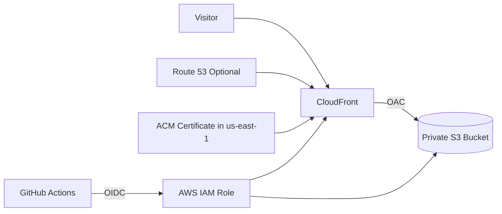

# AWS Static Website Platform

Production-style static website hosting on AWS with Terraform, CloudFront, S3, Route 53, ACM, IAM, and GitHub Actions.

## What this repository contains

- Private S3 origin behind CloudFront
- Optional custom domain support through Route 53
- ACM certificate provisioning for HTTPS
- GitHub Actions deployment workflow with OIDC
- Sample static website and clean repo structure
- Runbook and architecture notes

## Architecture



## Repo layout

```text
app/
infra/
docs/
.github/workflows/
```

## Planning docs

- [`docs/backlog.md`](docs/backlog.md)
- [`docs/milestones.md`](docs/milestones.md)
- [`CHANGELOG.md`](CHANGELOG.md)

## Assumptions

- Default AWS region: `ap-south-1`
- Custom domain is optional
- The first deployment can run with only the S3 bucket and CloudFront distribution
- Terraform workspaces are used for `dev` and `prod` environment separation

## Quick start

### 1. Bootstrap remote state

```bash
cd infra/bootstrap
cp terraform.tfvars.example terraform.tfvars
terraform init
terraform apply
```

Record the bucket and table names from the outputs, then create `infra/backend.hcl` from `infra/backend.hcl.example`.

### 2. Initialize the main stack with remote state

```bash
cp infra/backend.hcl.example infra/backend.hcl
cd infra
terraform init -backend-config=backend.hcl
terraform plan
terraform apply
```

For explicit environment files, use:

- [`infra/environments/dev/backend.hcl.example`](infra/environments/dev/backend.hcl.example)
- [`infra/environments/prod/backend.hcl.example`](infra/environments/prod/backend.hcl.example)

To run `dev`:

```bash
cp infra/environments/dev/backend.hcl.example infra/environments/dev/backend.hcl
cd infra
terraform init -backend-config=environments/dev/backend.hcl
terraform workspace select dev || terraform workspace new dev
```

To run `prod`:

```bash
cp infra/environments/prod/backend.hcl.example infra/environments/prod/backend.hcl
cd infra
terraform init -backend-config=environments/prod/backend.hcl
terraform workspace select prod || terraform workspace new prod
```

Use the matching tfvars examples in the same directories:

- [`infra/environments/dev/terraform.tfvars.example`](infra/environments/dev/terraform.tfvars.example)
- [`infra/environments/prod/terraform.tfvars.example`](infra/environments/prod/terraform.tfvars.example)

### 3. Configure GitHub Actions deployment

1. Set up AWS credentials for Terraform bootstrap or use your existing AWS auth.
2. Copy `infra/terraform.tfvars.example` to `infra/terraform.tfvars` and fill in any optional domain values.
3. Create and select a workspace:
   - `terraform workspace new dev`
   - `terraform workspace new prod`
4. Set the GitHub repository secrets or variables listed below.
5. Push to `main` to trigger the deploy workflow.

### GitHub Actions deploy

Set these repository secrets or variables:

- `AWS_ROLE_TO_ASSUME`
- `AWS_REGION`
- `S3_BUCKET_NAME`
- `CLOUDFRONT_DISTRIBUTION_ID`

If you enable a custom domain:

- `DOMAIN_NAME`
- `HOSTED_ZONE_ID`
- `HOSTED_ZONE_NAME`

### Workspaces

- `default` maps to the `environment_name` variable
- `dev` and `prod` are separate workspaces with distinct resource prefixes
- Use `terraform workspace select dev` before running `plan` or `apply` for that environment
- If you only know the zone name, set `hosted_zone_name` and Terraform will look up the zone ID automatically

### Stretch goals included

- CloudFront WAF protection
- Security headers via CloudFront response headers policy
- Multi-environment support through Terraform workspaces
- CloudFront invalidation in deployment

## Milestones

1. Repository skeleton and docs
2. Terraform infrastructure
3. Sample static site
4. GitHub Actions deploy pipeline
5. Security and cleanup guidance

## Notes

- CloudFront invalidation is included in deploys.
- ACM certificate validation is only created when a domain name and hosted zone are provided.
- Route 53 records are optional and can be enabled later.
- Lighthouse performance checks run in GitHub Actions on pull requests.
