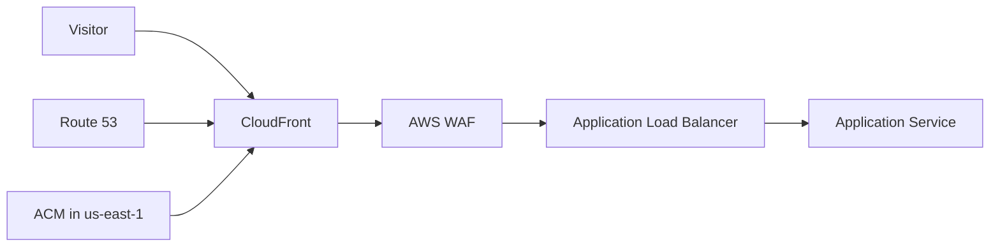

# Edge Delivery Security Platform

## Keynote

This project shows how to deliver a web workload through the AWS edge securely. It combines global routing, HTTPS, bot and abuse controls, and origin protection into one portfolio-ready stack.

## Best for

- Cloud security engineer
- Platform engineer
- DevOps engineer working on customer-facing systems

## Core AWS services

- CloudFront
- WAF
- ACM
- Route 53
- ALB
- VPC
- IAM
- CloudWatch

## What it proves

- Certificate and DNS automation
- Global edge control design
- WAF rule planning and rate limiting
- Origin isolation behind a load balancer

## Starter structure

```text
projects/25-edge-delivery-security-platform/
├── infra/
├── docs/
└── README.md
```

## Architecture



## Build prompt

> Build a production-style AWS edge delivery portfolio project using Terraform. Include CloudFront, WAF, ACM, Route 53, and an ALB-backed origin. Add security headers, HTTPS, optional domain support, health checks, logging, alarms, and a clear runbook. Keep the stack realistic for a single engineer and document the tradeoffs.
