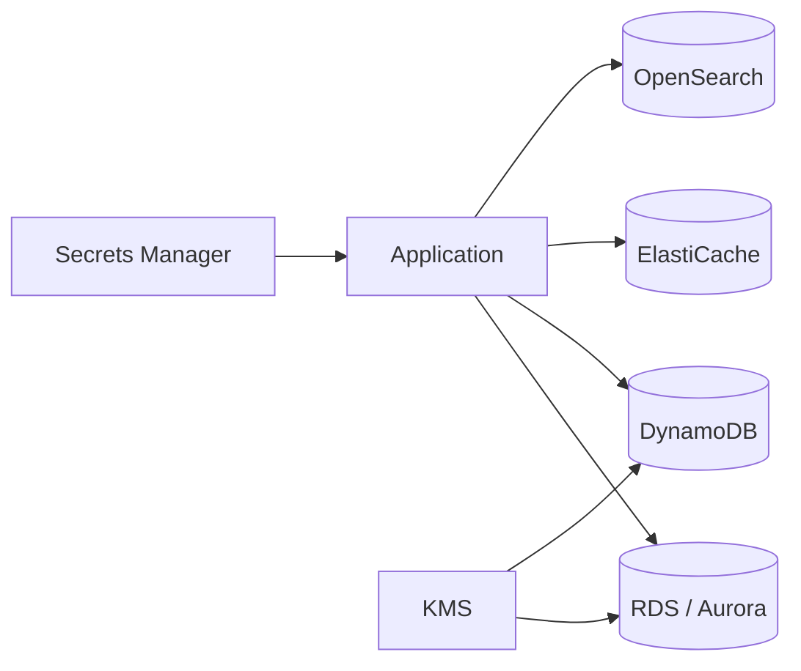

# Managed Data Platform

## Keynote

This project focuses on the managed data layer of an AWS architecture. It combines transactional databases, key-value state, cache acceleration, and search into one operationally coherent portfolio pack.

## Best for

- Senior cloud engineer
- Data platform engineer
- Platform engineer working with application data services

## Core AWS services

- RDS
- Aurora
- DynamoDB
- ElastiCache
- OpenSearch
- KMS
- Secrets Manager
- CloudWatch
- IAM

## What it proves

- Private data tier design
- Schema and workload separation
- Cache and search integration patterns
- Backup, encryption, and access boundary planning

## Starter structure

```text
projects/26-managed-data-platform/
├── infra/
├── docs/
└── README.md
```

## Architecture



## Build prompt

> Build a production-style AWS managed data platform portfolio project using Terraform. Include RDS or Aurora for relational workloads, DynamoDB for state, ElastiCache for low-latency reads, OpenSearch for search, encryption with KMS, secret handling, backups, logging, and operational runbooks. Show how the services work together without overcomplicating the design.
