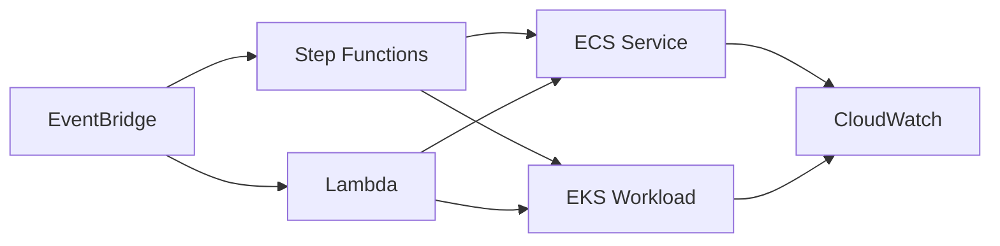

# Deep Systems Orchestration Platform

## Keynote

This project demonstrates how to combine containers, Kubernetes, functions, and workflow orchestration in one architecture. It is meant to show systems thinking rather than a single AWS service in isolation.

## Best for

- Senior platform engineer
- Senior cloud engineer
- DevOps engineer building mixed-compute systems

## Core AWS services

- ECS
- EKS
- Lambda
- Step Functions
- EventBridge
- ECR
- IAM
- CloudWatch

## What it proves

- Event routing and workflow orchestration
- Mixed compute service boundaries
- Platform choice tradeoffs between containers and Kubernetes
- Operational control across asynchronous systems

## Starter structure

```text
projects/27-deep-systems-orchestration-platform/
├── infra/
├── docs/
└── README.md
```

## Architecture



## Build prompt

> Build a production-style AWS deeper systems portfolio project using Terraform. Combine ECS, EKS, Lambda, Step Functions, and EventBridge into one orchestrated platform. Show how events move through the system, define practical service boundaries, include observability and IAM controls, and document when to use containers versus Kubernetes versus serverless.
