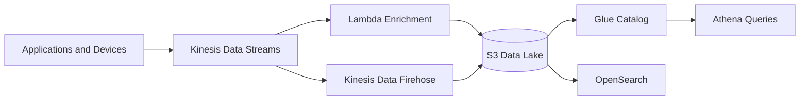

# Event Streaming Analytics Platform

## Keynote

This project shows how to ingest high-volume events, process them in near real time, and turn them into searchable and queryable data products.

## Best for

- Senior cloud engineer
- Data platform engineer
- Platform engineer working on event pipelines

## Core AWS services

- Kinesis Data Streams
- Kinesis Data Firehose
- Lambda
- S3
- Glue
- Athena
- OpenSearch
- CloudWatch
- IAM

## What it proves

- Streaming ingest design
- Separation of capture, transform, and query layers
- Durable data landing and catalog strategy
- Operational ownership of freshness and lag

## Starter structure

```text
projects/28-event-streaming-analytics-platform/
├── infra/
├── docs/
└── README.md
```

## Architecture



## Build prompt

> Build a production-style AWS event streaming analytics portfolio project using Terraform. Include Kinesis, Firehose, Lambda, S3, Glue, Athena, OpenSearch, logging, alarms, and clear data flow documentation. Keep the design realistic for a single engineer and show how the ingest, processing, and query layers stay decoupled.
