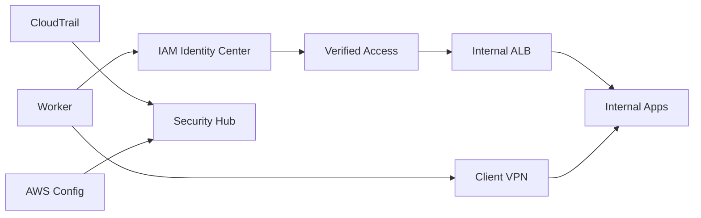

# Zero Trust Workforce Access Platform

## Keynote

This project shows how to give employees and contractors secure access to internal systems without relying on a flat network trust model.

## Best for

- Cloud security engineer
- IAM engineer
- Platform engineer focused on internal access

## Core AWS services

- IAM Identity Center
- Verified Access
- Client VPN
- ALB
- Route 53
- ACM
- CloudTrail
- Config
- Security Hub

## What it proves

- Identity-first access design
- Device-aware access planning
- Internal application exposure without public sprawl
- Audit and governance coverage for human access

## Starter structure

```text
projects/29-zero-trust-workforce-access-platform/
├── infra/
├── docs/
└── README.md
```

## Architecture



## Build prompt

> Build a production-style AWS zero-trust workforce access portfolio project using Terraform. Include IAM Identity Center, Verified Access, Client VPN, internal ALBs, audit logging, Config, Security Hub, and a clear access model. Show how internal users reach private apps safely without turning the network into a broad trust zone.
