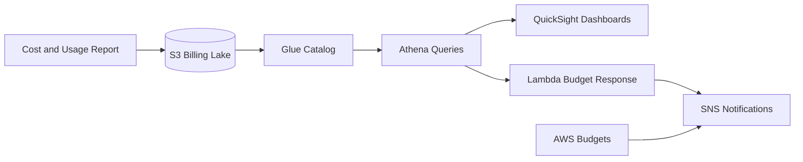

# Cloud Cost Intelligence Platform

## Keynote

This project turns AWS billing data into an operational control plane for cost visibility, forecasting, and budget response.

## Best for

- FinOps engineer
- Cloud platform engineer
- Cloud cost optimization lead

## Core AWS services

- Cost and Usage Report
- S3
- Glue
- Athena
- Lambda
- SNS
- Budgets
- QuickSight
- CloudWatch

## What it proves

- Cost data lake design
- Budget alerting and response automation
- Chargeback and showback patterns
- Queryable billing and usage analytics

## Starter structure

```text
projects/30-cloud-cost-intelligence-platform/
├── infra/
├── docs/
└── README.md
```

## Architecture



## Build prompt

> Build a production-style AWS cloud cost intelligence portfolio project using Terraform. Include CUR delivery into S3, Glue cataloging, Athena queries, QuickSight dashboards, budget alarms, notification automation, and a runbook. Show how the project supports both engineering teams and finance stakeholders.
