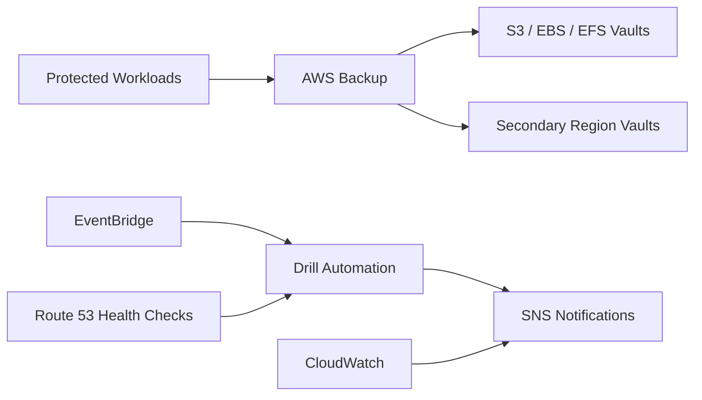

# Multi-Region Backup Drill Platform

## Keynote

This project shows how to validate recovery, not just create backups. It focuses on repeatable restore drills, cross-region resilience, and operational proof.

## Best for

- Senior cloud engineer
- Reliability engineer
- Cloud operations engineer

## Core AWS services

- AWS Backup
- S3
- EBS
- EFS
- EventBridge
- Lambda
- Route 53
- CloudWatch
- SNS

## What it proves

- Recovery workflow automation
- Cross-region backup strategy
- Restore testing and evidence collection
- Operational readiness beyond passive retention

## Starter structure

```text
projects/31-multi-region-backup-drill-platform/
├── infra/
├── docs/
└── README.md
```

## Architecture



## Build prompt

> Build a production-style AWS backup and restore drill portfolio project using Terraform. Include AWS Backup, S3, EBS, EFS, cross-region recovery, scheduled restore tests, SNS notifications, and a runbook that proves recovery instead of assuming it. Keep the design practical and auditable.
